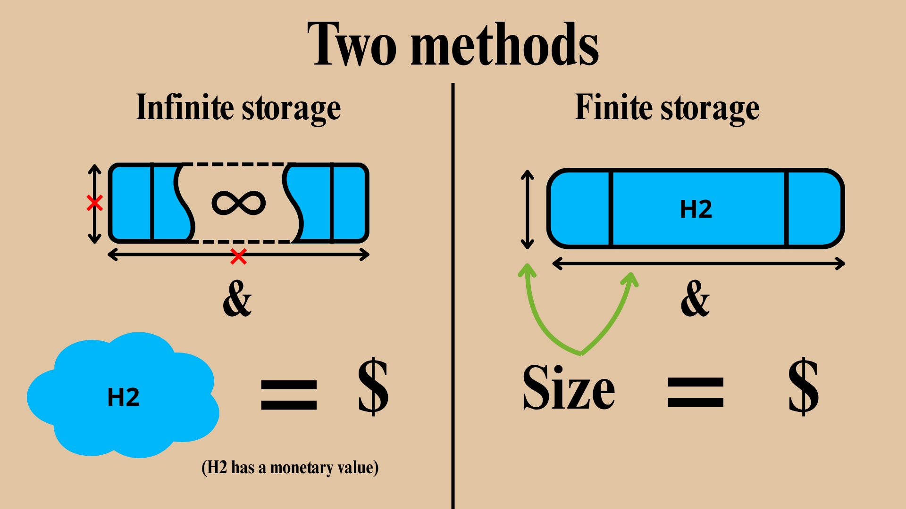
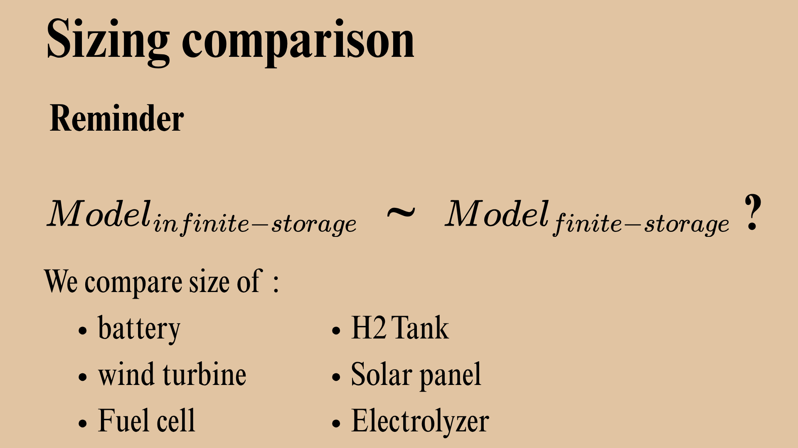

# Microgrids.JuMP

## Installation and testing

To install the latest released version of Microgrids.jl: `] add Microgrids`.

To install the lastest development version, follow the [instructions for unregistered packages](http://pkgdocs.julialang.org/v1/managing-packages/#Adding-unregistered-packages).
In particular, you can clone this repository and then, from the Julia command line,
navigate to the folder of your local copy and run:
- either `] add .` to install from the `main` branch of that local repository, but without tracking file changes
- or `] dev .` to install from that local repository *with* tracking file changes (see [dev](https://pkgdocs.julialang.org/v1/managing-packages/#developing) install)

The unit tests which ship with the package can be run with `] test Microgrids`.

## Version

april 2026

## Summary

An experimental code for microgrid sizing optimization using an algebraic formulation ([implemented with JuMP](https://jump.dev/)), rather than a simulator-based formulation (e.g. with [Microgrids.jl](https://github.com/Microgrids-X/Microgrids.jl))

This code corresponds to a relaxation of a finite storage model for an H2 tank by replacing it with an infinite storage price and penalize the usage of H2.

The goal is to try and found out if we can accurately approximate the finite model with the infnite model using metrics that are still to be determined.

Dependencies:

- [Microgrids.jl](https://github.com/nikiema-fruc/Microgrids.jl)

This dependency is a fork from [Microgird.jl](https://github.com/Microgrids-X/Microgrids.jl)